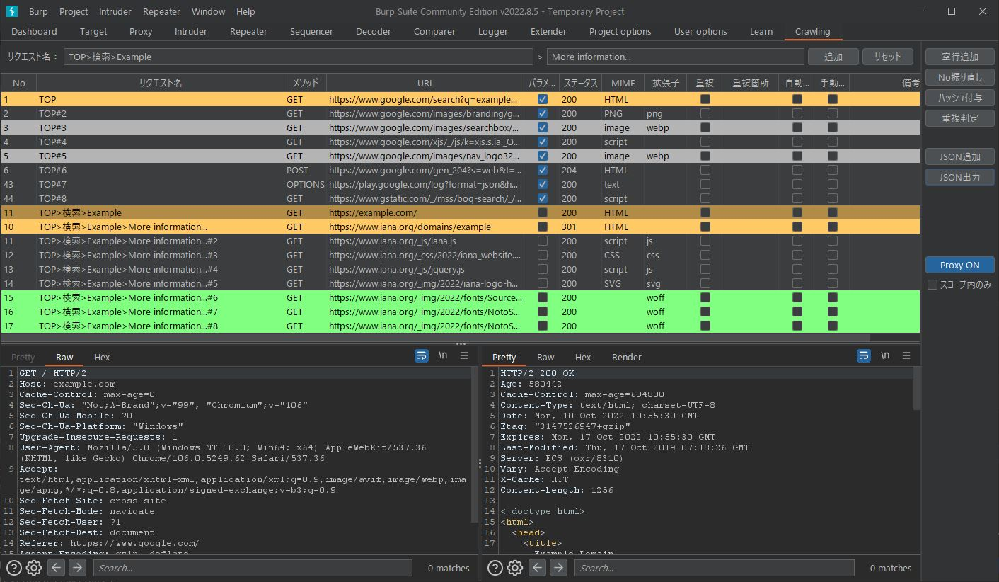

# burp-crawling


クローリングサポート用の [BurpSuite](https://portswigger.net/burp/releases) 拡張機能。

## キャプチャ



## 前提

- Java 11 (or later)
- BurpSuite 2020.1 (or later)

## ビルド

- for Windows

```ps
.\gradlew.bat clean fatJar
```

- for Linux

```sh
./gradlew clean fatJar
```

## ライセンス

[MIT](/LICENSE)

## 作成者

[salty-byte](https://github.com/salty-byte)
